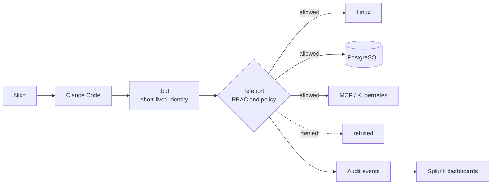
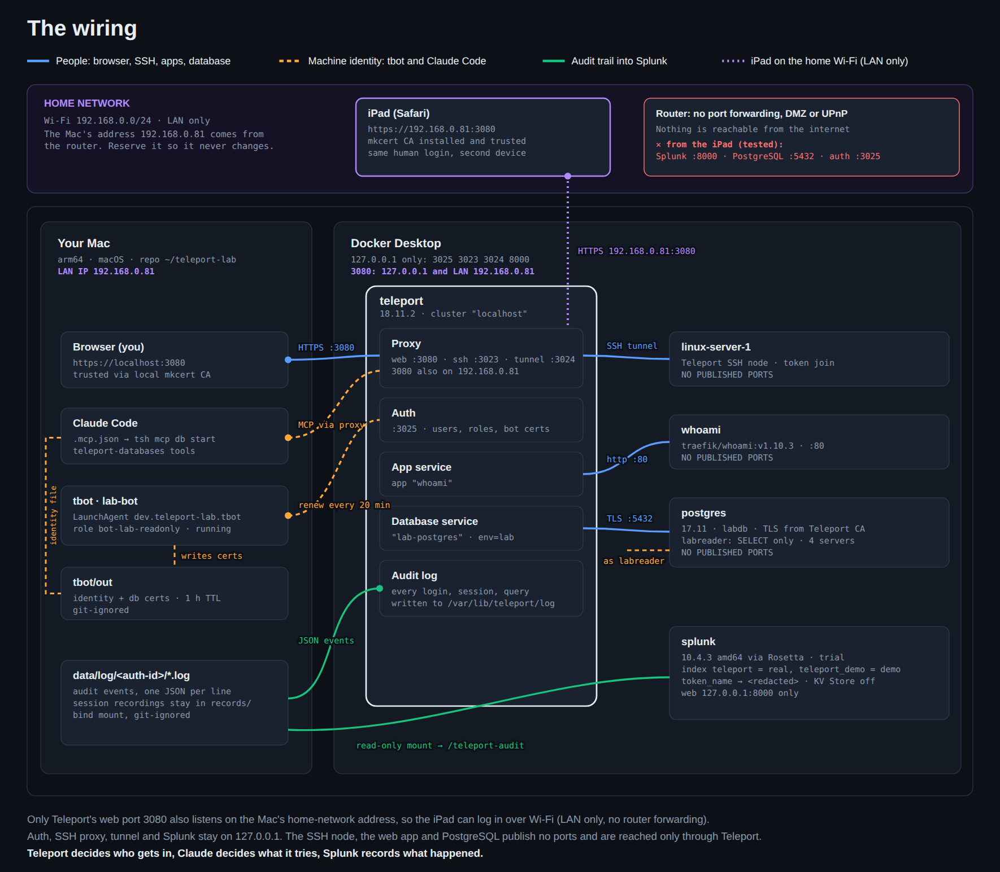

# Teleport Home Lab: identity for humans, machines and AI agents

A hands-on lab that shows one idea end to end:

> **Claude decides what it wants to do. Teleport decides what it is allowed to do. Splunk records what actually happened.**

It runs on a Mac with Docker Desktop and uses [Teleport](https://goteleport.com) (Community 18.11.2) as the identity and access layer, Claude Code as an AI agent with its **own** machine identity, and Splunk Enterprise as the place where the audit trail is proven and explained.

This is a learning and demo project, not a production deployment.

## What is in the lab

| Piece | What it is | Why it is here |
|---|---|---|
| Teleport (auth + proxy) | Identity-aware access layer, web UI, MFA | One front door for SSH, apps and databases, with short-lived certificates |
| `linux-server-1` | A small Linux server, reachable only through Teleport | Shows SSH without keys or open ports |
| `whoami` | A test web app, reachable only through Teleport | Shows app access with identity headers |
| `lab-postgres` | PostgreSQL 17, reachable only through Teleport | Shows database access with certificates, no passwords |
| `tbot` (Machine ID) | Gives a bot a short-lived identity | Lets Claude Code act as a machine, not as a human admin |
| MCP database server | `tsh mcp db start`, behind Teleport | Lets Claude Code query the lab database through Teleport policy |
| Splunk Enterprise 10.4.3 | Audit search and dashboards | Turns Teleport audit events into a story |
| `teleport_lab` Splunk app | Indexes, parsing, token masking, dashboards | Everything Splunk needs, kept in Git |

## The idea in one picture



### The wiring

How the pieces connect on the Mac: people (blue), the machine identity for Claude Code and `tbot` (orange dashed), the audit trail into Splunk (green), and the iPad on the home Wi-Fi (purple dotted, LAN only). Editable source: [docs/images/wiring-map.svg](docs/images/wiring-map.svg).



Only the Teleport proxy and auth ports and Splunk Web are published, on 127.0.0.1. The one exception is Teleport's web port 3080, which is also published on the Mac's home-network address so an iPad can log in (see Phase 2 in docs/ARCHITECTURE.md). The SSH node, the web app and PostgreSQL can only be reached through Teleport.

More detail: [docs/ARCHITECTURE.md](docs/ARCHITECTURE.md).

## Principles

1. **No standing credentials.** Certificates last hours, not months.
2. **Every action has an identity.** Humans, services and AI agents are all named and separate.
3. **Least privilege, read-only first.** The Claude Code bot can only read one lab database as a read-only user.
4. **Policy is code.** Roles live in Git and change by review.
5. **Prove it.** Every allow and deny is an audit event you can search.

The safety rules are in [docs/SECURITY_RULES.md](docs/SECURITY_RULES.md).

## Quick start (Mac)

Prerequisites: Docker Desktop, and the local secrets described in [docs/SETUP.md](docs/SETUP.md). Secrets are **not** in this repository.

```bash
docker compose ps                 # is everything running?
open https://localhost:3080       # Teleport web UI (local only)
open http://127.0.0.1:8000        # Splunk Web (local only)
```

Only Teleport's web port (3080) is published to the home network (LAN only, no router forwarding); every other port is bound to `127.0.0.1`, and the Linux server, web app and database publish no ports at all.

## The Splunk story (demo)

Seven classic dashboards and six Dashboard Studio dashboards turn the audit log into a demo:

- Trust Scorecard: are credentials short-lived, is every action attributed, what did policy block?
- Unified Identity Layer: humans, machines and AI agents on one layer, with a four-level "why was the AI agent refused?" drill-down
- Four scenes: day-one onboarding, auditor evidence, AI-agent governance, security watch
- Command Center: free drill-down to the raw evidence

See [docs/SPLUNK_DASHBOARDS.md](docs/SPLUNK_DASHBOARDS.md) and the run-of-show in [docs/DEMO_RUNBOOK.md](docs/DEMO_RUNBOOK.md).

Want to see the controls work? [docs/LAB_RUN_GUIDE.md](docs/LAB_RUN_GUIDE.md) shows how to simulate failures safely (bad logins, a denied bot, an AI agent trying to write, an expired credential) and watch them land in Splunk.

> The demo data is **synthetic**, clearly labelled (`demo=true`), and lives in its own index (`teleport_demo`). It is never mixed with real events in `index=teleport`. See [docs/DEMO_DATA.md](docs/DEMO_DATA.md).

## Repository map

```text
CLAUDE.md                 Instructions Claude Code reads first
PROJECT_STATUS.md         What works, what is next
docker-compose.yml        Teleport, Linux server, whoami, PostgreSQL, Splunk
config/                   Teleport config and roles (bot-lab-readonly)
node/                     Linux server image and Teleport node config
postgres/                 Init SQL (read-only role) and pg_hba.conf
tbot/                     tbot (Machine ID) config, macOS launch agent
splunk/apps/teleport_lab/ Splunk app: indexes, inputs, props, dashboards
scripts/                  Dashboard builders, demo data, demo helpers
docs/                     Architecture, security, setup, dashboards, runbook, build clock
.mcp.json                 Claude Code MCP server (Teleport database access)
```

## Status

See [PROJECT_STATUS.md](PROJECT_STATUS.md). In short: the Mac lab, Machine ID, MCP access and Splunk are working; the Ubuntu home server and a public DNS name with trusted TLS are the next phase.

How long it took: all 13 build steps in 3 h 41 min, minute by minute, in [docs/BUILD_CLOCK.html](docs/BUILD_CLOCK.html). It is a standalone web page: download it and open it in a browser (GitHub shows HTML files as source code).

## References

Official docs this lab was checked against are listed in [SOURCES.md](SOURCES.md).

## What this is not

- Not a production reference architecture: single node, local trust certificates, no high availability.
- Not a compliance claim: the dashboards support evidence for access-control and logging requirements but do not certify anything.
- Not an endorsement by, or affiliation with, Teleport, Splunk or Anthropic.
