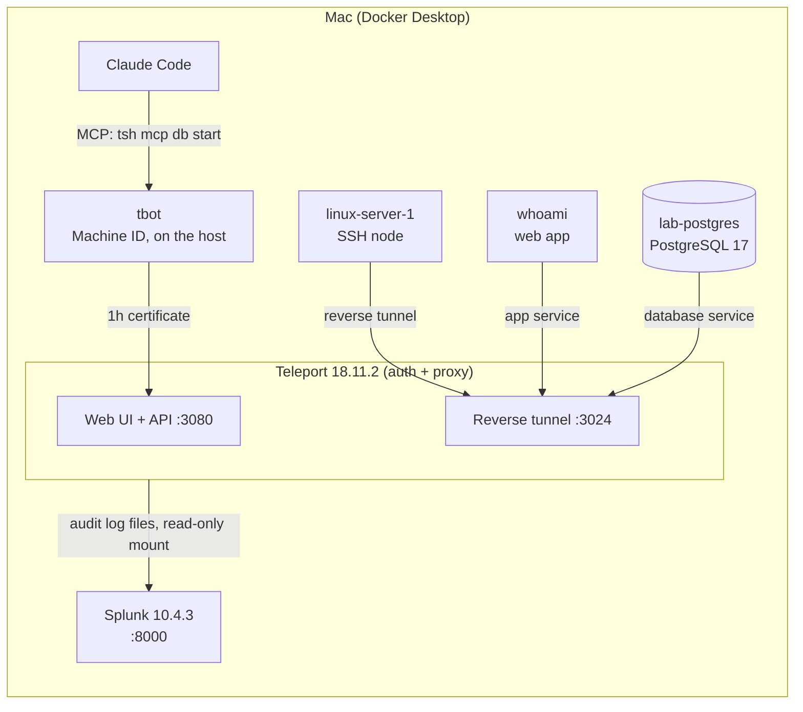
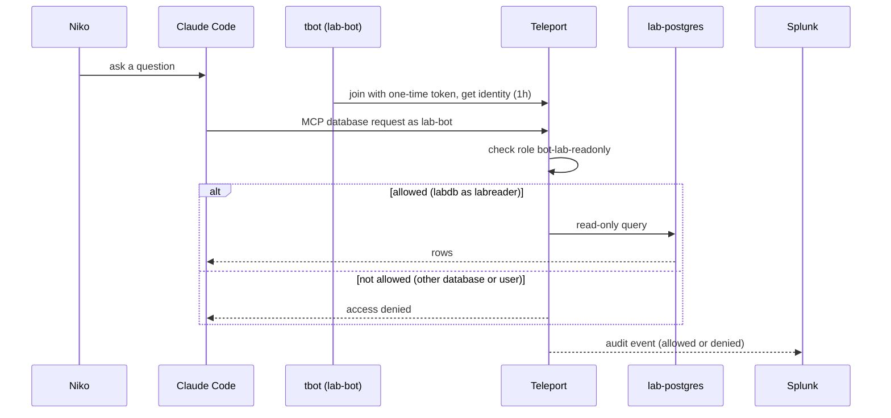
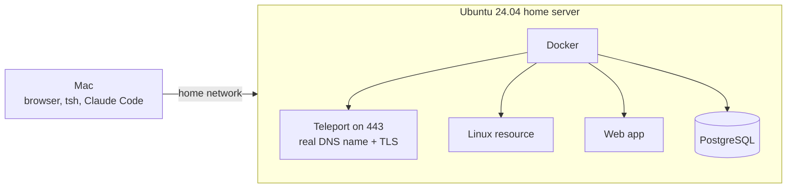

# Architecture

## Today: the Mac lab

Everything runs in Docker Desktop on one Mac. Only Teleport and Splunk publish ports, and only on `127.0.0.1`.

Key points:

- **Resources dial out.** The Linux server, app and database connect to Teleport over a reverse tunnel. They publish no ports, so there is nothing to attack from the network.
- **Certificates, not passwords.** PostgreSQL trusts Teleport-issued client certificates. The `labreader` database user has no password and is read-only.
- **Local TLS.** The proxy certificate comes from a local mkcert CA. That is fine for a lab, but the final demo needs a real DNS name and a public certificate (see the roadmap).
- **Splunk reads files, not the network.** It mounts the Teleport audit log folder read-only. Session recordings and keys are not mounted.

## The AI identity path

The bot role `bot-lab-readonly` allows only database `labdb` as user `labreader`, on databases labelled `env: lab`. It has no SSH, app, Kubernetes or admin rules.

## Observability path

| Stage | What happens |
|---|---|
| Teleport | Writes JSON audit events (logins, certificates, sessions, queries, denials) |
| Splunk input | Monitors the audit folder; index `teleport`, sourcetype `teleport:audit` |
| Parsing | JSON fields extracted at search time; join tokens masked before indexing |
| Dashboards | Classic and Dashboard Studio views in the `teleport_lab` app |
| Demo data | Synthetic events go to a **separate** index, `teleport_demo` |

## Roadmap architecture: Ubuntu home server

The Mac lab stays as the rollback copy until the Ubuntu lab is fully working.

## Why this design matters

| Design choice | Why it matters |
|---|---|
| Reverse tunnels | No inbound ports on resources |
| Short-lived certificates | A stolen credential expires in hours |
| Separate bot identity | AI activity is attributable and revocable on its own |
| Deterministic RBAC | The agent is non-deterministic; the policy is not |
| Audit events to Splunk | Every allow and deny can be searched, alerted on and explained |
